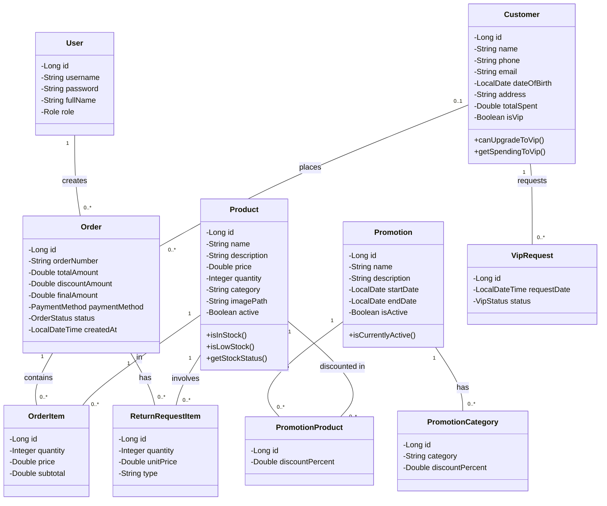
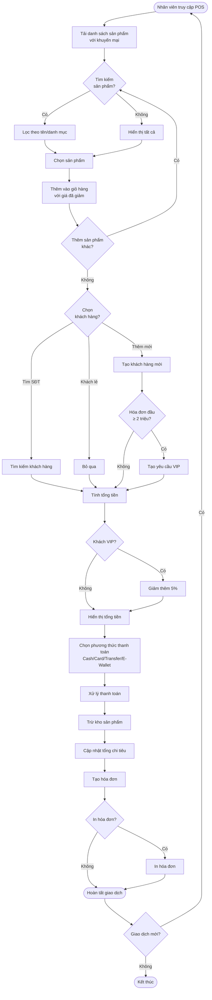
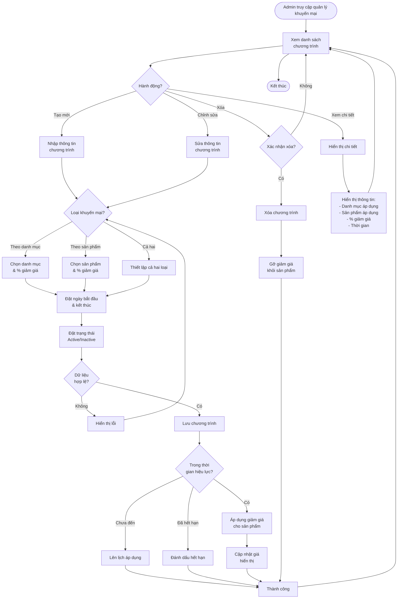
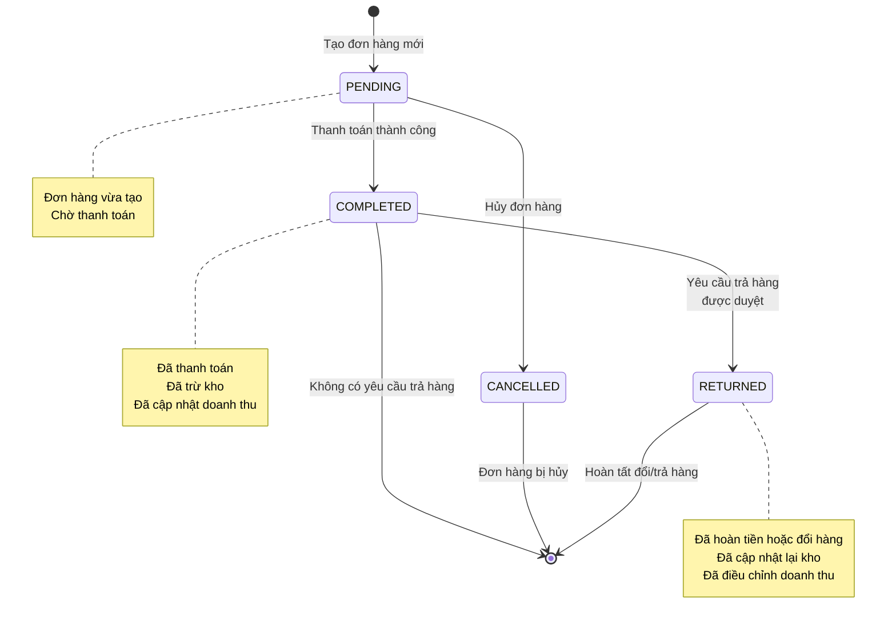
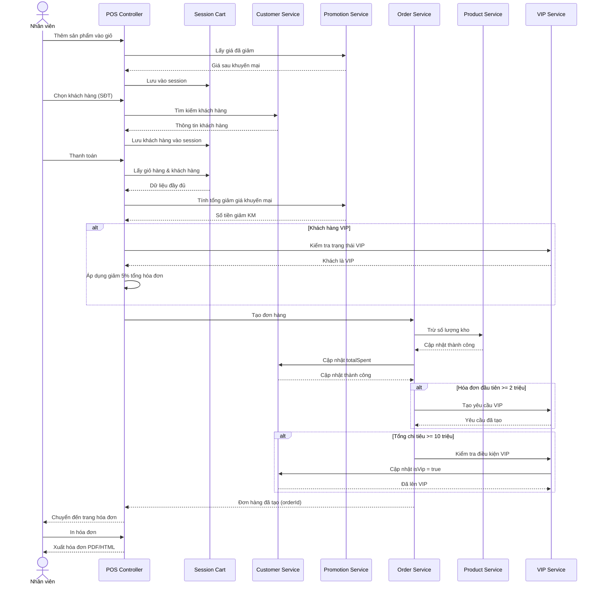
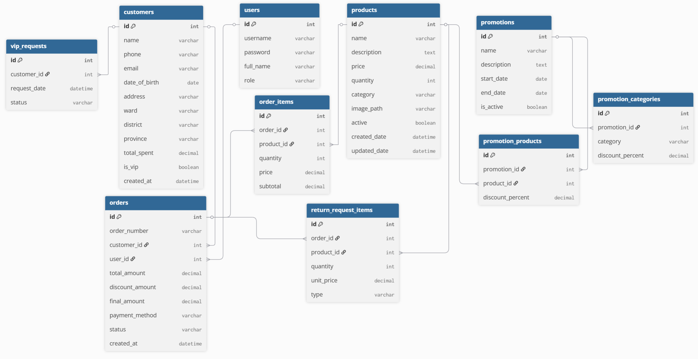

# PTTKPM_N02_K17_NHOM2 — Hệ thống quản lý bán hàng

---

## 1. Giới thiệu

**Hệ thống Quản lý Bán hàng** là một ứng dụng web được phát triển bằng Java Spring Boot, phục vụ cho việc quản lý toàn diện các hoạt động bán hàng của cửa hàng: quản lý sản phẩm, khách hàng, đơn hàng, khuyến mại, điểm bán hàng (POS), báo cáo doanh thu và nhiều chức năng mở rộng khác. Hệ thống hướng tới việc số hóa quy trình bán hàng, giúp nhân viên và quản lý thao tác nhanh chóng, chính xác, đồng thời tối ưu trải nghiệm khách hàng thông qua chương trình VIP và khuyến mại tự động.

---

## 2. Thành viên nhóm

| Họ tên              | MSSV      | Vai trò/Nhiệm vụ chính                                                 |
|---------------------|-----------|------------------------------------------------------------------------|
| Chu Thành Tân | 23010165    | Quản lý Framework, Quản lý Database, Merge & Pull Request, Back-end, Template, Xác thực & Phân quyền, Chức năng khuyến mại |
| Nguyễn Văn Hải  | 23017261    | Quản lý sản phẩm, quản lý khách hàng, POS, quản lý, xử lý đơn hàng, đổi trả hàng, chức năng thanh toán, xem doanh thu | 
| Nguyễn Anh Đức  | 23010650    |   |
| Nguyễn Thanh Hải  | 23010424    |    |
| GVHD: Mai Thuý Nga |        | Hướng dẫn, phản biện | 

---

## 3. Công nghệ sử dụng

- **Ngôn ngữ:** Java 17+
- **Framework:** Spring Boot 3.5.5, Spring MVC, Spring Data JPA, Spring Security
- **Cơ sở dữ liệu:** MySQL, Cloud Database Aiven
- **Template Engine:** Thymeleaf
- **Quản lý phụ thuộc:** Maven
- **Kiểm thử:** JUnit 5
- **Quản lý phiên bản:** Git, GitHub
- **Frontend:** HTML, CSS, Bootstrap 5, Font Awesome 6, JavaScript (Vanilla)
- **Khác:** Session-based Authentication, RESTful APIs

---

## 4. Chức năng chính đã xây dựng

### 4.1. Hệ thống xác thực & phân quyền
- Đăng nhập/đăng ký với 2 loại tài khoản: ADMIN và USER
- Phân quyền rõ ràng theo vai trò
- Session timeout và bảo mật

### 4.2. Chức năng ADMIN
- **Dashboard:** Thống kê tổng quan (sản phẩm, khách hàng, đơn hàng, doanh thu)
- **Quản lý sản phẩm:** CRUD, tìm kiếm nâng cao, cập nhật kho, bulk operations
- **Quản lý khách hàng:** CRUD, tìm kiếm, quản lý VIP, xem lịch sử mua hàng
- **Quản lý khuyến mại:** Tạo chương trình theo danh mục/sản phẩm, quản lý thời gian
- **Quản lý đơn hàng:** Xem tất cả đơn hàng, chi tiết đơn hàng
- **Quản lý doanh thu:** Báo cáo theo ngày/tháng/năm/khoảng thời gian
- **Quản lý trả hàng:** Duyệt/từ chối yêu cầu đổi trả

### 4.3. Chức năng USER (Nhân viên bán hàng)
- **Giao diện POS:** Bán hàng trực quan với giỏ hàng, tìm kiếm sản phẩm
- **Quản lý khách hàng:** Tìm kiếm, thêm mới khách hàng
- **Thanh toán:** Hỗ trợ nhiều phương thức (tiền mặt, thẻ, chuyển khoản, ví điện tử)
- **In hóa đơn:** Xuất hóa đơn điện tử chi tiết
- **Lịch sử giao dịch:** Xem đơn hàng đã tạo, lọc theo ngày/khách hàng/giá
- **Yêu cầu trả hàng:** Tạo yêu cầu đổi/trả sản phẩm
- **Xem doanh thu cá nhân:** Thống kê đơn hàng của nhân viên

### 4.4. Tính năng tự động
- **Hệ thống VIP:** Tự động tạo yêu cầu VIP khi đạt điều kiện
- **Khuyến mại:** Tự động áp dụng giá giảm khi thêm vào giỏ
- **Quản lý kho:** Tự động trừ kho khi thanh toán, cảnh báo sắp hết hàng

---

## 5. Cấu trúc thư mục Project

```
PTTKPM_N02_K17_NHOM2/
├── .gitattributes
├── .gitignore
├── mvnw
├── mvnw.cmd
├── pom.xml
├── README.md
├── src/
│   ├── main/
│   │   ├── java/
│   │   │   └── com/
│   │   │       └── pttkpm/
│   │   │           └── n02group2/
│   │   │               └── quanlybanhang/
│   │   │                   ├── Main.java
│   │   │                   ├── Controller/
│   │   │                   │   ├── AdminController.java
│   │   │                   │   ├── AuthController.java
│   │   │                   │   ├── CustomerController.java
│   │   │                   │   ├── OrderController.java
│   │   │                   │   ├── POSController.java
│   │   │                   │   ├── ProductController.java
│   │   │                   │   ├── PromotionController.java
│   │   │                   │   ├── ReturnAdminController.java
│   │   │                   │   ├── ReturnRequestController.java
│   │   │                   │   ├── RevenueController.java
│   │   │                   │   ├── UserController.java
│   │   │                   │   └── UserRevenueController.java
│   │   │                   ├── Model/
│   │   │                   │   ├── ApiResponse.java
│   │   │                   │   ├── Customer.java
│   │   │                   │   ├── Order.java
│   │   │                   │   ├── OrderItem.java
│   │   │                   │   ├── OrderRequest.java
│   │   │                   │   ├── Product.java
│   │   │                   │   ├── Promotion.java
│   │   │                   │   ├── PromotionCategory.java
│   │   │                   │   ├── PromotionProduct.java
│   │   │                   │   ├── ReturnRequestItem.java
│   │   │                   │   ├── User.java
│   │   │                   │   └── VipRequest.java
│   │   │                   ├── Repository/
│   │   │                   │   ├── CustomerRepository.java
│   │   │                   │   ├── OrderItemRepository.java
│   │   │                   │   ├── OrderRepository.java
│   │   │                   │   ├── ProductRepository.java
│   │   │                   │   ├── PromotionCategoryRepository.java
│   │   │                   │   ├── PromotionProductRepository.java
│   │   │                   │   ├── PromotionRepository.java
│   │   │                   │   ├── ReturnRequestItemRepository.java
│   │   │                   │   ├── UserRepository.java
│   │   │                   │   └── VipRequestRepository.java
│   │   │                   └── Service/
│   │   │                       ├── CustomerService.java
│   │   │                       ├── OrderService.java
│   │   │                       ├── POSService.java
│   │   │                       ├── ProductService.java
│   │   │                       ├── PromotionService.java
│   │   │                       └── UserService.java
│   │   └── resources/
│   │       ├── application.properties
│   │       └── templates/
│   │           ├── admin/
│   │           │   ├── dashboard.html
│   │           │   ├── customers/
│   │           │   │   ├── bill.html
│   │           │   │   ├── index.html
│   │           │   │   └── view.html
│   │           │   ├── products/
│   │           │   │   ├── edit.html
│   │           │   │   ├── index.html
│   │           │   │   ├── list.html
│   │           │   │   └── modals.html
│   │           │   ├── promotions/
│   │           │   │   ├── index.html
│   │           │   │   ├── modals.html
│   │           │   │   └── view.html
│   │           │   ├── return/
│   │           │   │   ├── detail.html
│   │           │   │   └── list.html
│   │           │   └── revenue/
│   │           │       ├── index.html
│   │           │       ├── view_simple.html
│   │           │       └── view.html
│   │           ├── auth/
│   │           │   ├── login.html
│   │           │   └── register.html
│   │           └── user/
│   │               └── pos/
│   │                   ├── bill.html
│   │                   ├── history.html
│   │                   ├── historyoder.html
│   │                   ├── interface.html
│   │                   ├── payment.html
│   │                   ├── return.html
│   │                   └── revenue.html
│   └── test/
│       └── java/
│           └── com/
│               └── pttkpm/
│                   └── n02group2/
│                       └── quanlybanhang/
│                           └── QuanlybanhangApplicationTests.java
└── target/
```

---

## 6. Mô tả chi tiết các đối tượng và chức năng

### 6.1. Người dùng (User)
- **Thuộc tính:** id, username, password, fullName, role (ADMIN/USER)
- **Chức năng:** 
  - ADMIN: Toàn quyền quản lý hệ thống
  - USER: Nhân viên bán hàng, sử dụng POS, xem báo cáo cá nhân

### 6.2. Sản phẩm (Product)
- **Thuộc tính:** id, name, description, price, quantity, category, imagePath, imageUrl, createdDate, updatedDate, active
- **Chức năng:** 
  - CRUD sản phẩm
  - Tìm kiếm nâng cao (tên, danh mục, khoảng giá, trạng thái kho)
  - Cập nhật kho đơn lẻ/hàng loạt
  - Xóa đơn lẻ/hàng loạt
  - Phân loại trạng thái: Còn hàng (>10), Sắp hết (1-10), Hết hàng (0)
  - Hỗ trợ khuyến mại tự động

### 6.3. Khách hàng (Customer)
- **Thuộc tính:** id, name, phone, email, dateOfBirth, address, ward, district, province, totalSpent, isVip, createdAt
- **Chức năng:**
  - CRUD khách hàng
  - Tìm kiếm theo tên/SĐT/địa chỉ
  - Quản lý trạng thái VIP
  - Xem lịch sử mua hàng
  - Thống kê chi tiêu
  - **Điều kiện VIP:**
    - Hóa đơn đầu tiên ≥ 2 triệu VNĐ
    - Tổng chi tiêu ≥ 10 triệu VNĐ
  - **Ưu đãi VIP:** Giảm 5% tổng hóa đơn

### 6.4. Đơn hàng (Order)
- **Thuộc tính:** id, orderNumber, customer, user, totalAmount, discountAmount, finalAmount, paymentMethod, status, createdAt
- **Trạng thái:** COMPLETED, PENDING, CANCELLED, RETURNED
- **Chức năng:**
  - Tạo đơn hàng từ POS
  - Xem chi tiết đơn hàng
  - In hóa đơn
  - Lọc theo thời gian/khách hàng/trạng thái
  - Hỗ trợ đổi trả

### 6.5. Chi tiết đơn hàng (OrderItem)
- **Thuộc tính:** id, order, product, quantity, price, subtotal
- **Chức năng:** Lưu thông tin sản phẩm trong đơn hàng với giá tại thời điểm mua

### 6.6. Khuyến mại (Promotion)
- **Thuộc tính:** id, name, description, startDate, endDate, isActive
- **Loại khuyến mại:**
  - **PromotionCategory:** Giảm giá theo danh mục (category, discountPercent)
  - **PromotionProduct:** Giảm giá theo sản phẩm (product, discountPercent)
- **Chức năng:**
  - Tạo/sửa/xóa chương trình
  - Áp dụng tự động theo thời gian
  - Hiển thị trạng thái: Đang áp dụng/Chưa bắt đầu/Đã kết thúc
  - Ưu tiên: Khuyến mại sản phẩm > Khuyến mại danh mục

### 6.7. Yêu cầu VIP (VipRequest)
- **Thuộc tính:** id, customer, requestDate, status (PENDING/APPROVED/REJECTED)
- **Chức năng:** 
  - Tự động tạo khi đạt điều kiện
  - Admin duyệt/từ chối
  - Hiển thị badge trên giao diện

### 6.8. Trả hàng (ReturnRequestItem)
- **Thuộc tính:** id, order, product, quantity, unitPrice, type (RETURN/RECEIVE)
- **Chức năng:**
  - Tạo yêu cầu trả sản phẩm (RETURN)
  - Chọn sản phẩm muốn nhận (RECEIVE)
  - Tính toán chênh lệch tự động
  - Admin duyệt: Hoàn tiền hoặc đổi hàng
  - Cập nhật kho tự động

---

## 7. Diagram

### 7.1. Class Diagram


### 7.2. Activity Diagram - Quy trình bán hàng POS



### 7.3. Activity Diagram - Quản lý khuyến mại



### 7.4. State Diagram - Vòng đời đơn hàng



### 7.5. Sequence Diagram - Quy trình thanh toán với VIP



---

## 8. Hướng dẫn sử dụng

### 8.1. Cài đặt & chạy dự án

**Yêu cầu:**
- Java 17+
- Maven 3.6+
- MySQL

**Các bước:**
```sh
git clone https://github.com/tanbentam/PTTKPM_N02_K17_NHOM2.git
cd PTTKPM_N02_K17_NHOM2
```

**Cấu hình database trong `application.properties`:**
```properties
spring.datasource.url= url_database
spring.datasource.username=your_username
spring.datasource.password=your_password
spring.jpa.hibernate.ddl-auto=update
```

**Chạy ứng dụng:**
```sh
mvn clean install
mvn spring-boot:run
```

=> Truy cập: [http://localhost:8080](http://localhost:8080)

### 8.2. Tài khoản demo

**Admin:**
- Username: `admin` / Password: `admin123`
- Username: `manager` / Password: `manager123`

**User (Nhân viên):**
- Username: `user1` / Password: `123456`
- Username: `customer` / Password: `customer123`

### 8.3. Sử dụng các chức năng chính

#### Đăng nhập
1. Truy cập `/login`
2. Nhập username/password
3. Hệ thống tự động điều hướng theo role

#### Quản lý sản phẩm (Admin)
- Truy cập: `/admin/products`
- Thêm sản phẩm: Click "Thêm sản phẩm"
- Tìm kiếm: Sử dụng bộ lọc (tên, danh mục, giá, kho)
- Cập nhật kho: Click icon "Kho" trên từng sản phẩm
- Bulk actions: Chọn nhiều sản phẩm → Cập nhật kho/Xóa hàng loạt

#### Quản lý khách hàng (Admin)
- Truy cập: `/admin/customers`
- Xem chi tiết: Click vào tên khách hàng
- Duyệt VIP: Vào chi tiết khách hàng → Click "Duyệt VIP"

#### Bán hàng POS (User)
1. Truy cập: `/user/pos`
2. Tìm sản phẩm: Gõ tên hoặc chọn danh mục
3. Thêm vào giỏ: Click vào sản phẩm
4. Chọn khách hàng: Click icon người dùng → Tìm hoặc thêm mới
5. Thanh toán: Click "Thanh toán" → Chọn phương thức → Xác nhận
6. In hóa đơn: Click "In hóa đơn" trên trang kết quả

#### Quản lý khuyến mại (Admin)
1. Truy cập: `/admin/promotions`
2. Tạo chương trình: Click "Thêm chương trình"
3. Chọn loại giảm giá:
   - Theo danh mục: Chọn danh mục + nhập % giảm
   - Theo sản phẩm: Tìm sản phẩm + nhập % giảm
4. Đặt thời gian hiệu lực
5. Lưu → Khuyến mại tự động áp dụng

#### Xem báo cáo doanh thu (Admin)
1. Truy cập: `/admin/revenue`
2. Chọn bộ lọc: Ngày/Tháng/Năm/Khoảng thời gian
3. Xem danh sách hóa đơn
4. Click vào hóa đơn để xem chi tiết

---

## 9. API Endpoints

### 9.1. Xác thực
- `GET /login` — Trang đăng nhập
- `POST /login` — Xử lý đăng nhập
- `GET /register` — Trang đăng ký
- `POST /register` — Xử lý đăng ký
- `GET /logout` — Đăng xuất

### 9.2. Dashboard
- `GET /admin/dashboard` — Dashboard Admin
- `GET /user/dashboard` — Dashboard User

### 9.3. Sản phẩm
- `GET /admin/products` — Danh sách sản phẩm (có phân trang + filter)
- `POST /admin/products/add` — Thêm sản phẩm
- `POST /admin/products/edit` — Sửa sản phẩm
- `POST /admin/products/delete` — Xóa sản phẩm
- `GET /admin/products/{id}` — Chi tiết sản phẩm
- `POST /admin/products/update-stock` — Cập nhật kho
- `POST /admin/products/bulk-update-stock` — Cập nhật kho hàng loạt
- `POST /admin/products/bulk-delete` — Xóa hàng loạt
- `GET /admin/products/categories` — Lấy danh sách danh mục

### 9.4. Khách hàng
- `GET /admin/customers` — Danh sách khách hàng
- `POST /admin/customers/add` — Thêm khách hàng
- `POST /admin/customers/edit` — Sửa khách hàng
- `GET /admin/customers/delete/{id}` — Xóa khách hàng
- `GET /admin/customers/{id}/profile` — Chi tiết khách hàng
- `GET /admin/customers/search` — Tìm kiếm khách hàng
- `POST /admin/customers/approve-vip/{id}` — Duyệt VIP
- `POST /admin/customers/reject-vip/{id}` — Từ chối VIP

### 9.5. POS (Point of Sale)
- `GET /user/pos` — Giao diện POS
- `GET /user/pos/products` — Lấy danh sách sản phẩm
- `GET /user/pos/categories` — Lấy danh mục
- `GET /user/pos/api/products-with-promotions` — Sản phẩm + khuyến mại
- `GET /user/api/customers/search?query={phone}` — Tìm khách hàng
- `POST /user/pos/customer/create` — Tạo khách hàng mới
- `POST /user/api/orders` — Tạo đơn hàng
- `GET /user/pos/payment` — Trang thanh toán
- `POST /user/pos/process-payment` — Xử lý thanh toán
- `GET /user/pos/bill` — Trang hóa đơn
- `GET /user/pos/history` — Lịch sử giao dịch
- `GET /user/pos/history/{id}` — Chi tiết đơn hàng

### 9.6. Khuyến mại
- `GET /admin/promotions` — Danh sách khuyến mại
- `POST /admin/promotions/add` — Thêm chương trình
- `GET /admin/promotions/{id}` — Chi tiết khuyến mại
- `POST /admin/promotions/{id}` — Cập nhật khuyến mại
- `GET /admin/promotions/delete/{id}` — Xóa khuyến mại
- `GET /admin/promotions/api/active` — Khuyến mại đang hoạt động
- `GET /admin/promotions/api/product/{id}/discount` — Giá sau khuyến mại

### 9.7. Doanh thu
- `GET /admin/revenue` — Trang báo cáo doanh thu
- `GET /admin/revenue/filter` — Lọc doanh thu theo thời gian
- `GET /admin/revenue/view/{id}` — Chi tiết hóa đơn

### 9.8. Trả hàng
- `GET /admin/returns` — Danh sách yêu cầu trả hàng
- `GET /admin/returns/{id}` — Chi tiết yêu cầu
- `POST /admin/returns/{id}/approve` — Duyệt trả hàng
- `POST /admin/returns/{id}/reject` — Từ chối trả hàng
- `GET /user/pos/return` — Tạo yêu cầu trả hàng
- `POST /user/pos/return/submit` — Gửi yêu cầu

---

## 10. Cấu trúc Database

### 10.1. Bảng chính

**users**
- id (PK), username, password, full_name, role

**products**
- id (PK), name, description, price, quantity, category, image_path, active, created_date, updated_date

**customers**
- id (PK), name, phone, email, date_of_birth, address, ward, district, province, total_spent, is_vip, created_at

**orders**
- id (PK), order_number, customer_id (FK), user_id (FK), total_amount, discount_amount, final_amount, payment_method, status, created_at

**order_items**
- id (PK), order_id (FK), product_id (FK), quantity, price, subtotal

**promotions**
- id (PK), name, description, start_date, end_date, is_active

**promotion_categories**
- id (PK), promotion_id (FK), category, discount_percent

**promotion_products**
- id (PK), promotion_id (FK), product_id (FK), discount_percent

**vip_requests**
- id (PK), customer_id (FK), request_date, status

**return_request_items**
- id (PK), order_id (FK), product_id (FK), quantity, unit_price, type (RETURN/RECEIVE)

### 10.2. Mối quan hệ
- User 1-N Orders
- Customer 0-N Orders
- Customer 1-N VipRequests
- Order 1-N OrderItems
- Product 1-N OrderItems
- Promotion 1-N PromotionCategories
- Promotion 1-N PromotionProducts
- Product 1-N PromotionProducts
- Order 1-N ReturnRequestItems

### 10.3. Sơ đồ cấu trúc Database



---

## 11. Kiểm thử

### 11.1. Unit Tests
```sh
mvn test
```

### 11.2. Test Coverage
- Model validation tests
- Service logic tests
- Repository query tests
- Controller endpoint tests

### 11.3. Test Cases chính
- ✅ Đăng nhập với các role khác nhau
- ✅ Thêm/sửa/xóa sản phẩm
- ✅ Tìm kiếm sản phẩm với nhiều điều kiện
- ✅ Tạo đơn hàng với khuyến mại
- ✅ Áp dụng giảm giá VIP
- ✅ Tự động tạo yêu cầu VIP
- ✅ Xử lý trả hàng và hoàn kho
- ✅ Tính toán doanh thu chính xác

---

## 12. Tính năng nâng cao (có thể mở rộng)

- 📊 Dashboard analytics với biểu đồ
- 📧 Gửi email hóa đơn cho khách hàng
- 📱 SMS thông báo khuyến mại
- 🎁 Điểm tích lũy và đổi quà
- 📦 Quản lý nhà cung cấp
- 🚚 Theo dõi vận chuyển
- 💳 Tích hợp payment gateway
- 🔔 Hệ thống thông báo realtime
- 📈 Dự báo doanh thu bằng AI
- 🌐 Đa ngôn ngữ (i18n)
- 📱 Mobile app (React Native/Flutter)
- 🔐 Two-factor authentication

---

## 13. Tài liệu tham khảo

- [Spring Boot Documentation](https://spring.io/projects/spring-boot)
- [Thymeleaf Documentation](https://www.thymeleaf.org/documentation.html)
- [Bootstrap 5 Documentation](https://getbootstrap.com/docs/5.1/)
- [Font Awesome Icons](https://fontawesome.com/)

---

## 14. Liên hệ & Hỗ trợ

- **Repository:** [GitHub Link](https://github.com/tanbentam/PTTKPM_N02_K17_NHOM2)
- **Issues:** [GitHub Issues](https://github.com/tanbentam/PTTKPM_N02_K17_NHOM2/issues)
- **Email:** chuthanhtan1995@gmail.com

---

## 15. Bản quyền

Dự án thuộc sở hữu của nhóm 2 - PTTKPM N02 K17, năm học 2025-2026.  
Chỉ sử dụng cho mục đích học tập và nghiên cứu.

---

**© 2025 PTTKPM_N02_K17_NHOM2. All rights reserved.**